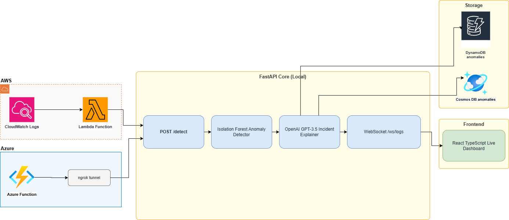
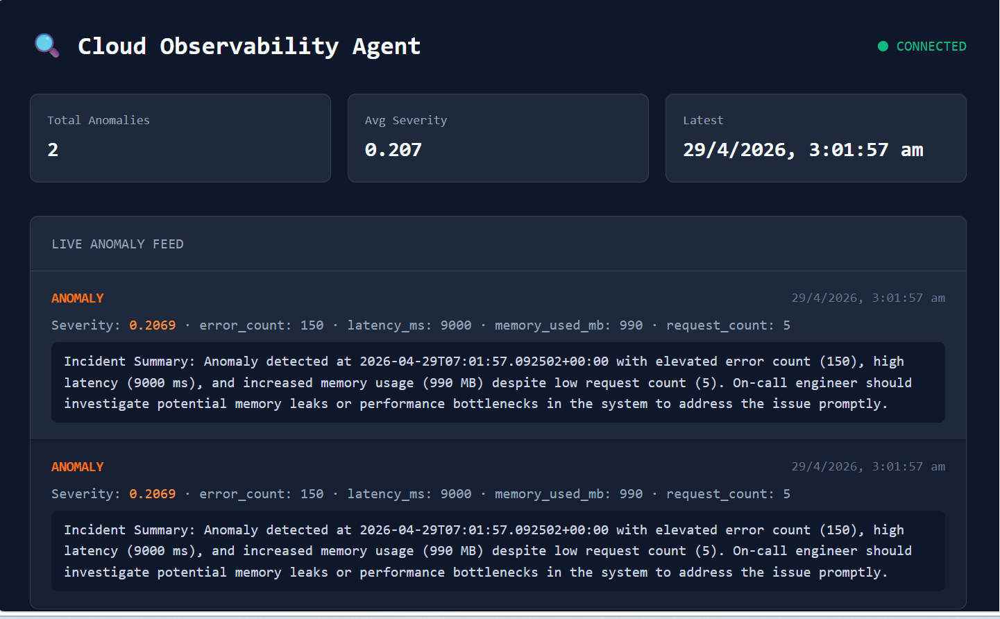
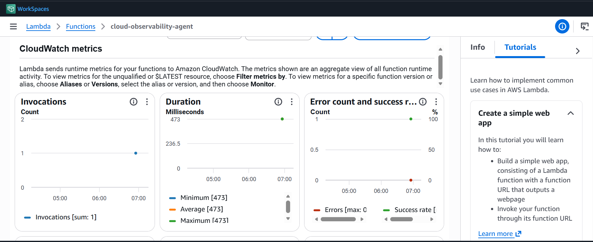
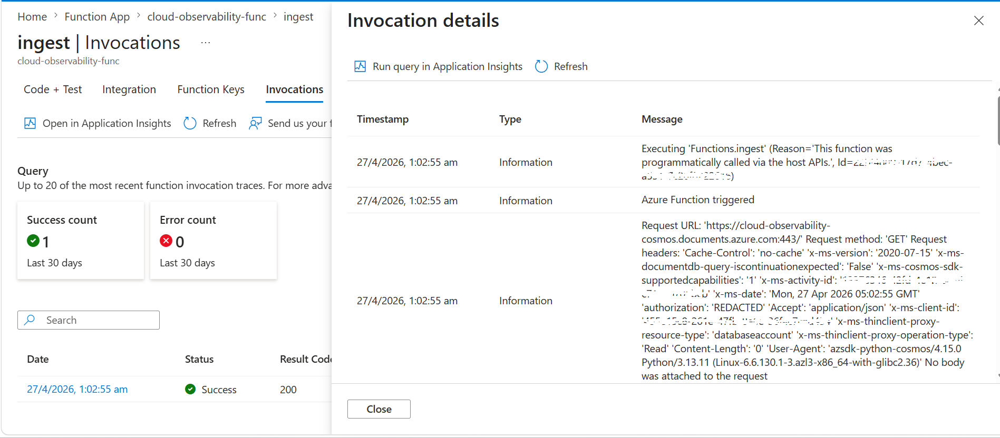
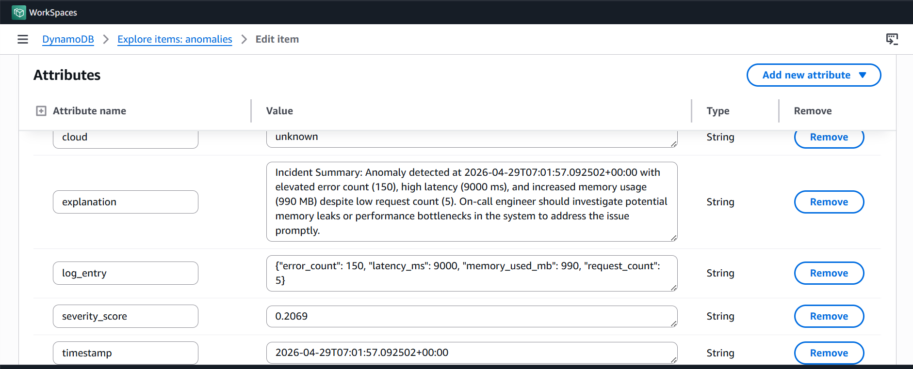
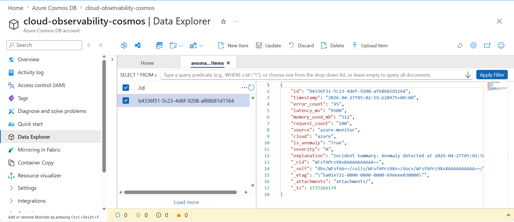
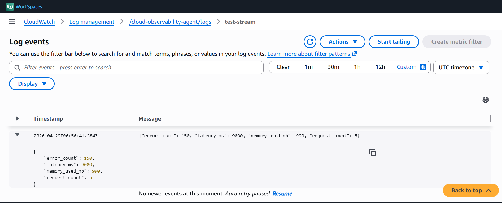
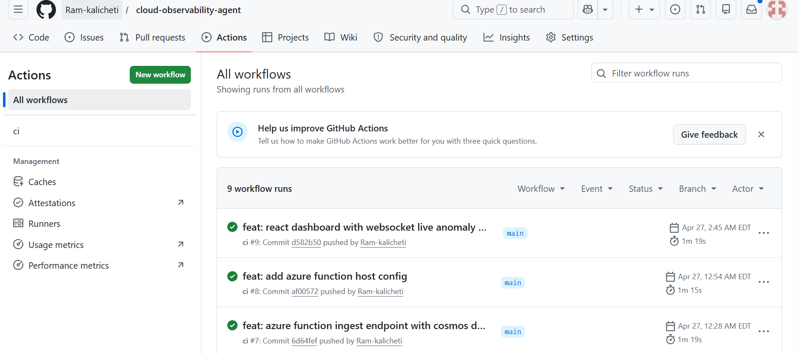

# Cloud Observability Agent 🔍

An autonomous log anomaly detection system that monitors cloud infrastructure in real time, detects anomalies using machine learning, and generates AI-powered incident summaries for on-call engineers.

---

## Architecture



---

## Tech Stack

| Layer | Technology |
|---|---|
| Anomaly Detection | Python, scikit-learn (Isolation Forest) |
| AI Explanation | OpenAI API (gpt-3.5-turbo) |
| API | FastAPI, WebSockets |
| AWS | Lambda, CloudWatch, DynamoDB |
| Azure | Azure Functions, Cosmos DB |
| Frontend | React TypeScript, Vite |
| DevOps | Docker, GitHub Actions CI |

---

## How It Works

1. **Ingest** — CloudWatch logs trigger a Lambda function on new entries; Azure Functions mirror the same pipeline via an HTTP endpoint. Both forward log data to the FastAPI `/detect` endpoint.

2. **Detect** — An Isolation Forest model (trained on 200 synthetic baseline entries) scores each log entry. Entries with anomaly scores above the threshold are flagged.

3. **Explain** — Flagged anomalies are passed to OpenAI GPT-3.5, which generates a human-readable incident summary with recommended actions for the on-call engineer.

4. **Store & Stream** — Anomalies are saved to DynamoDB (AWS) and Cosmos DB (Azure) simultaneously. The FastAPI WebSocket broadcasts each anomaly in real time to the React dashboard.

---

## Screenshots

### Live Anomaly Dashboard


---

### Compute — Lambda vs Azure Functions

| AWS Lambda | Azure Functions |
|:---:|:---:|
|  |  |
| Invocation metrics, 473ms duration, 0 errors | HTTP trigger invocation logs |

---

### Storage — DynamoDB vs Cosmos DB

| Amazon DynamoDB | Azure Cosmos DB |
|:---:|:---:|
|  |  |
| Anomaly record with OpenAI explanation | Mirrored anomaly record in Azure |

---

### Observability — CloudWatch Logs



---

### CI Pipeline — GitHub Actions



All jobs passing — lint, pytest, Docker build ✅

---

## Key Results

- **Detection latency:** ~473ms end-to-end (Lambda invoke → anomaly saved)
- **Dual-cloud coverage:** AWS and Azure pipelines running in parallel
- **AI-generated summaries:** Every anomaly gets an OpenAI incident report
- **Live dashboard:** WebSocket feed updates in real time with no page refresh

---

## Local Setup

### Prerequisites
- Python 3.13
- Node.js v20+
- AWS CLI configured (`aws configure`)
- Azure Functions Core Tools v4
- OpenAI API key

### Run FastAPI
```bash
cd cloud-observability-agent
export OPENAI_API_KEY="your-key-here"
python -m uvicorn app.main:app --host 0.0.0.0 --port 8000
```

### Run React Dashboard
```bash
cd frontend
npm install
npm run dev
```
Open [http://localhost:5173](http://localhost:5173)

### Trigger a Test Anomaly
```bash
python -c "
import requests
payload = {'error_count': 150, 'latency_ms': 9000, 'memory_used_mb': 990, 'request_count': 5}
r = requests.post('http://localhost:8000/detect', json=payload)
print(r.json())
"
```

---

## CI Pipeline

GitHub Actions runs on every push:
- `lint` — flake8 code style check
- `test` — pytest unit tests for the anomaly detector
- `docker` — Docker image build verification

All jobs passing ✅

---

## Repository Structure

```
cloud-observability-agent/
├── app/
│   ├── main.py              # FastAPI app + WebSocket
│   ├── detector.py          # Isolation Forest anomaly detector
│   ├── explainer.py         # OpenAI incident explainer
│   └── requirements.txt
├── azure_function/
│   ├── function_app.py      # Azure Function HTTP trigger
│   ├── host.json
│   └── requirements.txt
├── frontend/                # React TypeScript dashboard
│   └── src/App.tsx
├── tests/
│   └── test_detector.py
├── .github/workflows/
│   └── ci.yml
├── docs/screenshots/        # screenshots
└── Dockerfile
```

---

*Built by Sitha Ram Reddy Kalicheti — George Mason University M.S. Applied Information Technology*
